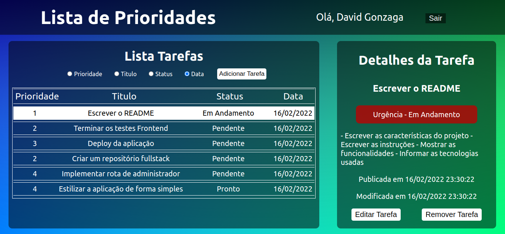
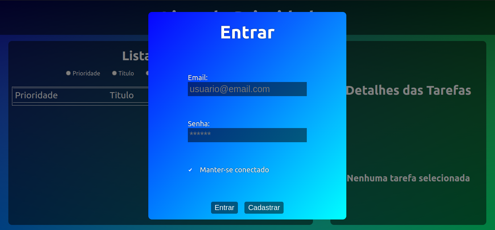
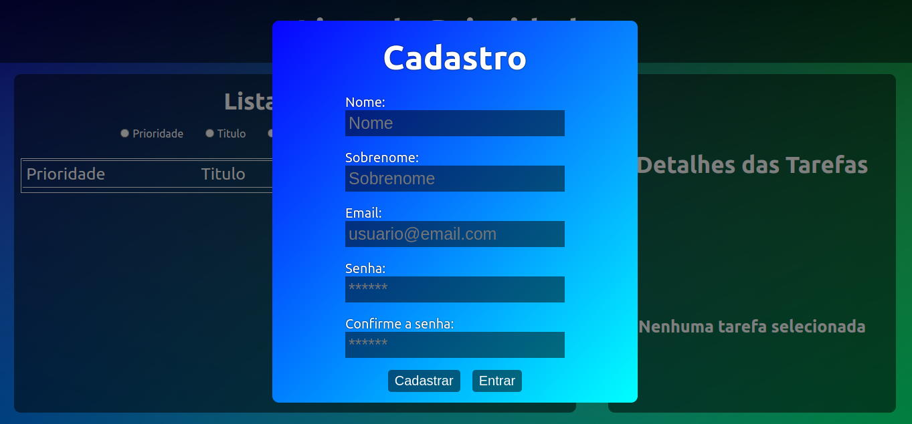
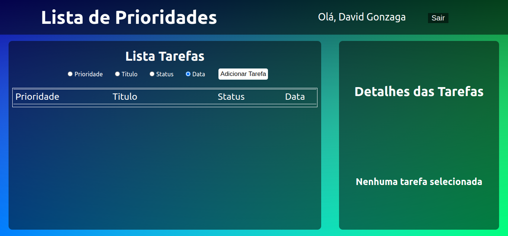
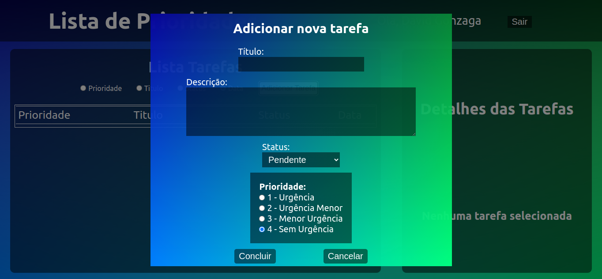
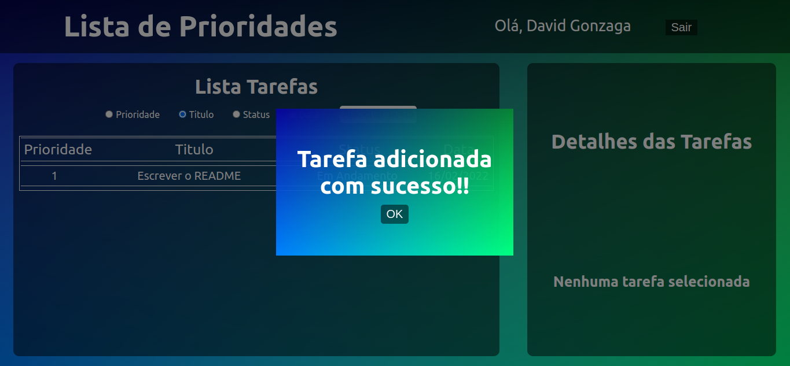
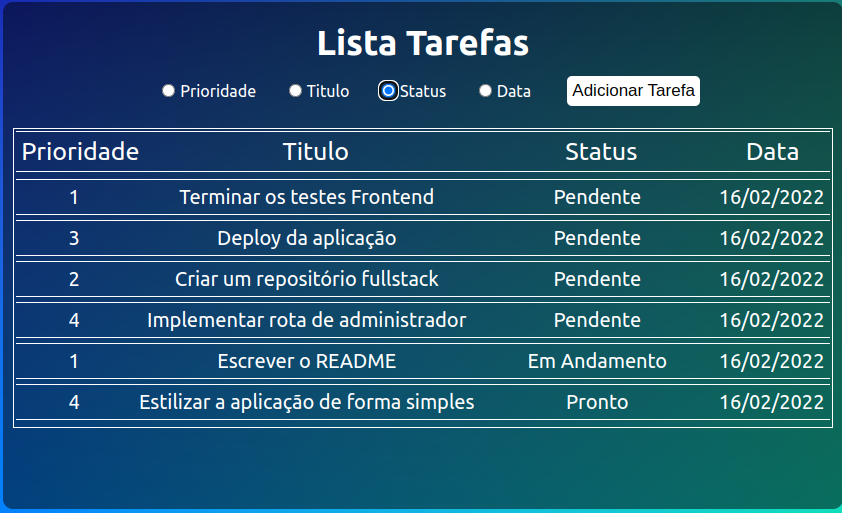
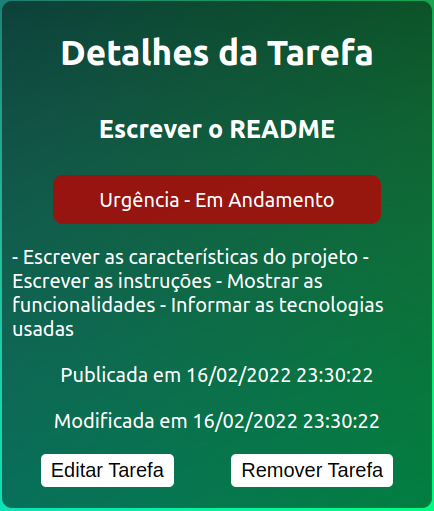
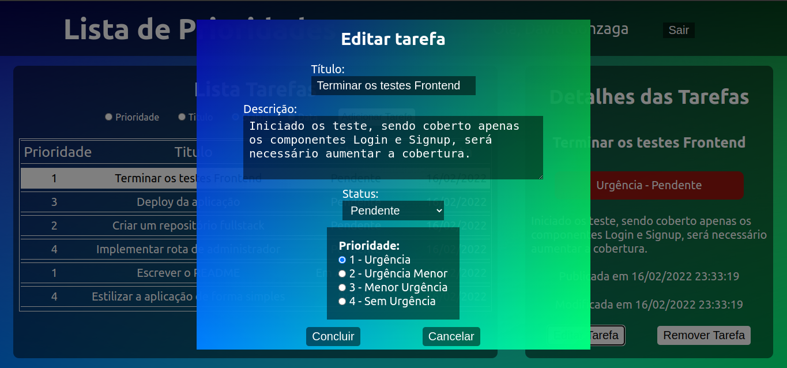
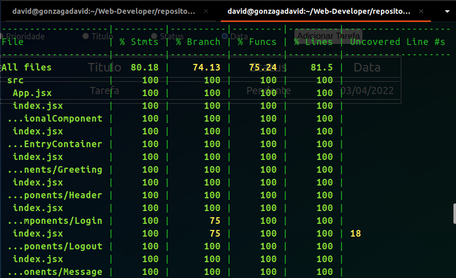

# Lista de Prioridades - Frontend

<h1><a href="https://todo-list-frontend-green.vercel.app/" >Visite a Aplicação</a></h1>

<h2><a href="https://github.com/Gonzagadavid/todo-list-backend" >Repositório Lista de Prioridades - Backend</a></h2>

--- 

# Sumário

- [Introdução](#introdução)
- [Instruções](#instruções)
- [Detalhes da aplicação](#detalhes)
  - [Login](#login)
  - [Cadastro](#cadastro)
  - [Página Inicial](#página-inicial)
  - [Adicionar uma nova tarefa](#adicionar-uma-nova-tarefa)
  - [Lista de Tarefas](#lista-de-tarefas)
  - [Detalhes da Tarefa](#detalhes-da-tarefa)
  - [Editar Tarefa](#editar-tarefa)
- [Tecnologias](#tecnologias)
- [Testes](#testes)
- [Deploy](#deploy)

# Intordução

O desenvolvimento da aplicação Lista de Prioridades teve como proposito otimizar a organização e produtividade das pessoas. Forma visual, a pessoa poderá organizar sua lista de tarefas, classificando a tarefa por nível de prioridade, status e data.

# Instruções

1 - abra o terminal

2- clone o repositório do Backend `git clone git@github.com:Gonzagadavid/todo-list-backend.git`

3- entre no diretório do repositorio clonado `cd todo-list-backend`

4- execute o comando para instalar as dependências `npm install`

5- preencha o arquivo `.env-eg` com os dados do seu banco de dados MongoDB local e mude o nome do arquivo para `.env`  
*caso não tenha o MongoDB instalado siga o seguinte [tutorial](https://docs.mongodb.com/manual/installation/)* 

6- execute o comando para iniciar o servidor `npm start`

7- abra um nova janela do terminal

8- clone o repositório do Frontend `git clone git@github.com:Gonzagadavid/todo-list-frontend.git`

9- entre no diretório do repositorio clonado `cd todo-list-frontend`

10- execute o comando para instalar as dependências `npm install`

11- execute o comando para iniciar a aplicação `npm start`

12- a aplicação iniciará em `http://localhost:3000`

# Detalhes

## Login 

Ao iniciar o uso da aplicação será renderizado a tela de login, onde a pessoa usuária terá que informar o e-maile a senha, o botão `Entrar` será habilitado somente com todos os campos preenchidos, tendo como opção a pessoa manter-se logada na aplicação mesmo após fechar o navegador. Caso a pessoa não tenha cadastro, basta clicar no botão de cadastrar que a aplicação renderizará o formulário de registro.

## Cadastro

Após a pessoa usuária clicar no botão cadastrar será renderizado o formulário de cadastro, a pessoa terá que informar nome, sobrenome, e-mail, senha e confirmar a senha, somente com esses campos preenchidos o botão 'Cadastrar' será habilitado. Após o registro ser feito o login será feito, porém só será válido durante a primeira sessão, sendo necessário o login na proxima sessão.

## Página inicial

Depois de logar a página principal será renderizada, exibindo uma saudação com o nome da pessoa usuária no canto superior direito, junto ao botão de sair. A aplicação exibe dois container, um para exibir a lista de tarefas e um para exibir os detalhes das tarefas.

## Adicionar uma nova tarefa

Na parte superior da lista de tarefas é localizado um botão para adicionar um nova tarefa, ao clicar no botão será renderizado um formulário para adicionar a tarefa, com os seguintes campos: titulo, descrição, status e prioridade.

## Lista de tarefas

Na lista de tarefas a pessoa usuária tem as opções de ordenar as tarefas por: prioridade, titulo, status e data, ao clicar em uma tarefa o detalhes da tarefa selecionada será exibido em Detalhe da Tarefa

## Detalhes da tarefa

A tarefa selecionada na lista de tarefas será renderizada com os seguites detalhes: Título, prioridade, status, descrição, publicada em e modificada em. Em detalhes da tarefa também está localizado os botões para remover a tarefa e edita-la.

## Editar tarefa

Ao clicar no botão de `editar tarefa` a tarefa selecionada será renderizada em um formulario para a modificação.

# Tecnologias

- React
- Redux
- Testing Library
- Axios
- Eslint

   
  &nbsp;&nbsp;&nbsp;
  
  &nbsp;&nbsp;&nbsp;
  
  &nbsp;&nbsp;&nbsp;
  

# Testes

Desenvolvido testes unitários para os componentes Login e Signup

Para executar os testes implementado execute o comando `npm test`

Para verificar a cobertura de test execute o comanto `npm run coverage`

# Deploy

# Deploy

Para o deploy da aplicação foi escolhido a [Vercel](#https://vercel.com/)

<h1><a href="https://todo-list-frontend-green.vercel.app/" >Visite a Aplicação</a></h1>

# Futuras implementações

- cobertura de teste em 100% da aplicação

- implementar página para a pessoa adminitradora direcionar tarefas para outras pessoas usuárias
